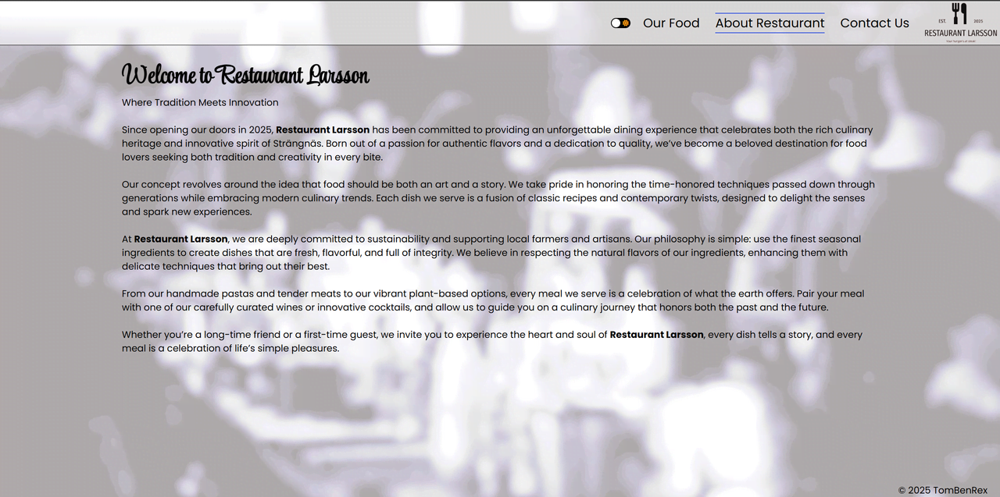
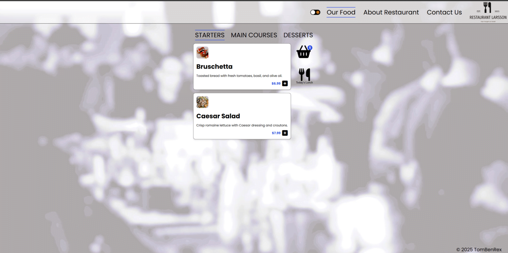
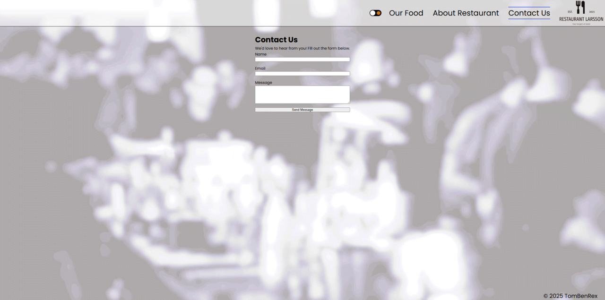
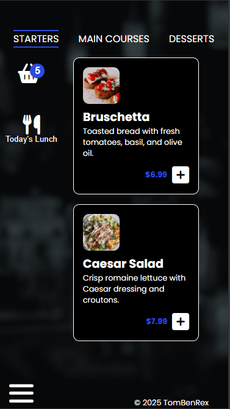
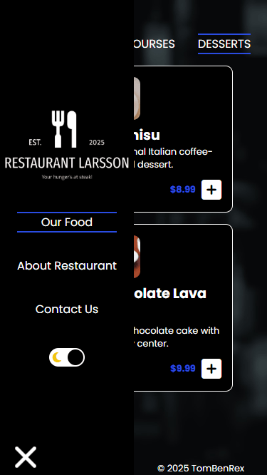

 
 
 
 
 

  

:point_right:<a href="https://tombenrex.github.io/restaurant/" target="blank">Live Server</a> :point_left:

##

<h1 align="center">Hi 👋, I'm Tom Larsson</h1>
<h3 align="center">An upcoming frontend developer from Sweden</h3>

  

- 🌱 I’m currently learning **HTML, Javascript, CSS, React**

- 📫 How to reach me **92tomlar@skola.boras.se**

- ⚡ Fun fact **Started build houses now building webpages**

<h3 align="left">Connect with me:</h3>

<h3 align="left">Languages and Tools:</h3>

    

# Om uppgiften

Du ska skapa en responsiv och interaktiv webbplats för en restaurang. Webbplatsen ska ha en tydlig struktur och erbjuda en bra användarupplevelse genom enkel navigering och stilren design. Syftet är att öva på HTML för struktur, CSS för design och JavaScript för interaktivitet.

# Case

# Vad du ska göra

1. **Skapa en startsida** med en välkomnande och inbjudande sektion som presenterar restaurangen genom en detaljerad beskrivning av dess koncept, historia och mat-filosofi.
2. **Menysektion** som innehåller tre välorganiserade kategorier med tydliga beskrivningar av varje maträtt:
    - Förrätter
    - Varmrätter
    - Efterrätter
3. **Lunchbuffé**
    - Omfattande information om lunchbuffén, inklusive att den serveras måndag-fredag med detaljer om serveringstider och dagens specialerbjudanden.
    - Detaljerad prislista för lunchbuffén med information om eventuella tillval och dryckesalternativ.
4. **Prislista**
    - Komplett och överskådlig lista med aktuella priser för samtliga rätter, inklusive information om allergener och specialkost.
5. **Navigeringsmeny** som erbjuder smidiga och intuitiva länkar till alla webbplatsens olika sektioner med tydlig visuell feedback.
6. **Responsiv design** som säkerställer en optimal användarupplevelse på alla enheter, från stora datorskärmar till små mobiltelefoner, med anpassad layout och läsbarhet.
7. Du ska paketera din applikation för leverans (Deploy) Du behöver inte att leverera eller deploya

## **Funktionalitet**

- **HTML**: Strukturerad layout med rätt semantiska element.
- **CSS**:
    - Använd flexbox och/eller grid för layout.
    - Styla menyer och innehåll så att det ser attraktivt ut.
- **JavaScript**:
    - Skapa en interaktiv meny där användare kan filtrera rätter baserat på kategori.
    - En knapp för att visa/dölja lunchbuffé-information.
    - En enkel beräkning av totalkostnad för beställda rätter.
